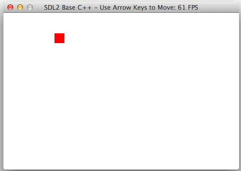

# SDL2 C++ Boilerplate

This is a simple SDL2 example that allows a user to move a sprite using arrow keys. This is meant to be used as a convenient single-file starting point for more complex projects.

Here is a screenshot of what the program looks like when it runs:

## Building Windows MinGW/Codeblocks

Linker settings (in Code::Blocks under Project->Build Options...)

`-lmingw32 -lSDL2main -lSDL2`

## Building Mac XCode

Download the SDL2 DMG file and add the SDL2.framework into your Linker settings

[https://www.libsdl.org/release/SDL2-2.0.10.dmg](https://www.libsdl.org/release/SDL2-2.0.10.dmg)

